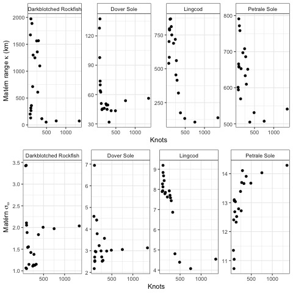
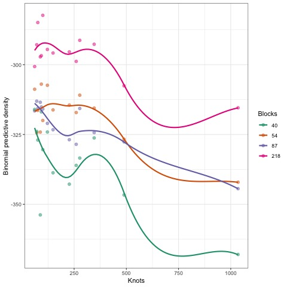

```{r setup, include=FALSE, echo=FALSE}
knitr::opts_chunk$set(echo = TRUE, tidy=FALSE, tidy.opts=list(width.cutoff=60), warning = FALSE, message = FALSE)
library(knitr)
library(ggrepel)
library(viridis)
library(gridExtra)
library(cowplot)
```

## Abstract
\setlength\parindent{24pt}

1. Spatial and spatiotemporal models are seeing increasingly used in ecology and related fields to model latent distributions. Applications relying on these methods have used them to track population change over time, assess changing species distributions, and model spatial population processes (predation, habitat use, fishing impacts, etc). 

2. Computational advances over the last decade have allowed for the rapid estimation of spatial approximations to high dimensional spatial surfaces (100s or more georeferenced points), and these methods have been accessible in software implementing the Integrated Nested Laplace Approximation (INLA). One of the most critical decisions for building INLA--based models is how to construct the spatial approximation ("mesh"). Little guidance has been established in constructing these approximations, with many previous applications suggesting that higher resolution meshes result in better performance. Using a publicly available dataset on commercially fished species on the west coast of the USA, we develop spatial models of species occurrence and catch rates for 4 species. We conduct a series of sensitivity analyses, across We examine the sensitivity of mesh resolution to explain the occurrence and catch rates, across a range of mesh features (resolution, spatial cross validation).  

3. Our results highlight that for both presence-absence and positive (Gamma) models, the finest scale spatial approximations considered overfit the data and resulted in decreased out of sample predictive performance. For each of the species and models considered, there appeared to be an optimal range of vertices (knot) used in constructing the spatial approximation. These results held across a range of spatial cross-validation sampling schemes, including folds selected in 1-dimensional latitudinal blocks, and the use of 2-dimensional spatial blocks.

4. Results from our work highlight that practicioners should not assume that the performance of INLA--based models gets better with higher resolution. Instead, each dataset likely has a range of resolutions that is optimal, and these optimal ranges may be identified using spatial cross-validation approaches, such as the sampling procedures used in our analysis. Selecting models with the appropriate spatial complexity is expected to improve parameter estimates and derived quantities (estimates of populaiton abundance, distribution, etc.). 

## Key words
Spatial, spatiotemporal, Integrated Nested Laplace Approximation (INLA), Gaussian random field, mesh, predictive accuracy

## Introduction

Recent computational advances have allowed for the rapid estimation of large spatial and spatiotemporal models in ecology and related fields [@banerjee_bayesian_2012].
Motivating questions for these applications to large georeferenced datasets including tracking abundance in time and space, identifying environmental predictors of occurrence, or quantifying range shifts in distribution [@ross_accessible_2012; @miller_spatial_2013; @thorson_comparing_2017].

There are a number of statistical approaches for developing models with spatial components; examples include generalized additive models (GAMs) [@forney_habitat-based_2012; @murase_application_2009], non-parametric approaches [@mutanga_high_2012], and applications of Gaussian random fields [@datta_hierarchical_2016; @latimer_hierarchical_2009].
Advances by @rue_approximate_2009 have enabled the development of the Integrated Nested Laplace Approximation (INLA) as a fast and efficient approximation to estimating high-dimensional Gaussian random fields.
These models have been extended to include the ability to fit geographic barriers, such as islands or lakes, anisotropic covariance functions, and non-Gaussian data [@bakka_spatial_2018].
In addition to estimating Bayesian posterior distributions [@lindgren_bayesian_2015], INLA has been integrated with Template Model Builder (TMB; [@kristensen_tmb_2016; @osgood-zimmerman_statistical_2021]) to enable auto-differentiation and has been adopted in many spatial fisheries applications around the world [e.g., @johnson_investigating_2019; @thorson_measuring_2019].

Constructing spatiotemporal models with INLA or related software involves many of the same considerations as with simpler non-spatial models.
For example, modelers frequently ask: "Which covariates are most important?" and "Does my model do a satisfactory job of making predictions?" Spatial or spatiotemporal models may include additional considerations, such as specifying the form of spatiotemporal variation [@anderson_black_2019].
One of the more complicated and important decisions---particularly for INLA based models---lies in specifying the dimensionality of the latent spatial fields [@lindgren_bayesian_2015].
Unlike Generalized Additive Models (GAMs), which often penalize smooth terms [@wood2003], penalties in overfitting INLA models are not as apparent.

One of the first steps in fitting a model with INLA involves choosing the appropriate resolution of the spatial field using a "mesh" (a map consisting of small triangles, e.g., Figure 1).
By estimating values of the spatial field at the triangle vertices (or "knots"), the spatial field may be triangulated to coordinates where data are observed or predictions are made [@lindgren_explicit_2011].
There are a number of decision points to be made in constructing the mesh, including whether to include a boundary, whether the boundary is regular, the maximum edge of any triangle (in the core or boundary area), and the minimum angles allowed by the triangles [@gomez-rubio_bayesian_nodate].
Each of these decisions can impact the density and number of small triangles that make up the mesh---and in turn, the accuracy of predictions.
Though the mesh construction is important, this step has been omitted from best practices guides using an INLA-based approach [@thorson_guidance_2019], and we are only aware of one sensitivity analysis examining the importance of mesh construction [@righetto_choice_2020].
While many previous applications and guidance around INLA have suggested that increasing the resolution of the mesh improves predictive accuracy [@godana_dynamic_2019; @wilson_evaluating_2021; @williamson_spatiotemporal_nodate; @thorson_guidance_2019], a much smaller number of studies have noted that finer meshes don't always translate into better performance [@huang_evaluating_2017].

The objective of this paper is to examine whether higher resolution spatial approximations in INLA translate to better predictive accuracy.
Using a series of analyses on a real-world case study of groundfishes in the Northeast Pacific Ocean, we evaluate the out-of-sample predictive performance as a function of mesh resolution (number of knots). We further evaluate these results across a range of cross-validation sampling schemes (number of spatial blocks and folds), including an extreme case of leave-one-out cross validation (LOOCV).
All data for our analysis are publicly available, and code and data to reproduce our analysis is available on Github (XXXX) and Zenodo (on publication).

## Methods

### Data

As a case study to evaluate the effect of mesh resolution on predictive ability of INLA-based models, we use a publicly available dataset of catch rates from scientific surveys in the Northeast Pacific Ocean (<https://www.nwfsc.noaa.gov/data>)).
The West Coast Bottom Trawl Survey (WCBTS) dataset represents a fishery-independent survey collected annually over a 19-year period, 2003-2021, covering the California Current ecosystem on the west coast of the USA [@keller_northwest_2017].
The survey is designed to estimate the abundance, sizes, and age composition of commercially and recreationally targeted groundfish species found in near-bottom habitats.
The fundamental methods of the survey, sampling intensity, gear, seasonal and spatial coverage, and random stratified design have remained relatively constant.
Because of the large number of model runs needed, we restricted our analysis to only use data from 2018 (n = 702 observations).
Though hundreds of species our encountered in the survey, we restricted our analysis to four species that are of interest to fisheries, but also represent a range of occurrences: Dover Sole (*Microstomus pacificus*, encountered in 593 tows), Petrale Sole (*Eopsetta jordani*, 291 tows), Lingcod (*Ophiodon elongatus*, 225 tows), and Darkblotched Rockfish (*Sebastes crameri*, 105 tows). The overall mean distance between tow locations in the WCBTS was 676.7km ($\tilde{x}$ = 603.1km). 

### Modeling

Because of the presence of zeros and positive continuous values in fish survey datasets such as the WCBTS data, conventional approaches to analyzing these data have used a delta or hurdle model to separately model occurrence and positive catches [e.g., @johnson_investigating_2019; @thorson_guidance_2019].
We adopt a similar approach in our modeling, using a binomial distribution with a logit link to model species occurrence, and a Gamma distribution with a log link to model positive catch rates (kg per km2).
For simplicity and consistency with fisheries assessments using these data [@@johnson_investigating_2019], we fit models estimating an intercept and spatial field throughout, e.g.

$$g(u_{s}) = B_{0}+\omega_{s}$$\
where $\omega_{s}$ is the estimated spatial field, $B_0$ is the intercept, $u_s$ is the expected value for point in space $s$, and $g()$ is an inverse link function.

All of the meshes in our analysis used a non-convex boundary and offset based on 5% of the data (Figure 1).
We fixed the maximum edge of triangles in the mesh at 100km in the core area and 500km closer to the boundary (Figure 1).
Throughout our analyses, we adjusted the mesh resolution by varying the cutoff distance (representing the distance where two points are treated as a single vertex) because the cutoff distance has been shown to have the greatest impact on measures of model performance from mesh construction [@righetto_choice_2020].
We fit all models using R-INLA [@R2021; @lindgren_bayesian_2015] and R 4.1.0 [@R2021] and specifically the 'inlabru' R package, which is a convenient wrapper for the INLA software [@bachl_inlabru_2019].
We used penalized complexity priors on the Matérn covariance parameters [@simpson_penalising_2015;  @osgood-zimmerman_statistical_2021]. Specifically, priors on the Matérn spatial range ($\kappa$) and marginal standard deviation ($\sigma_{\omega}$) are constructed as a function of the tail probabilities [@simpson2017; @fuglstad2018]. We assigned priors so that $Pr(\kappa < 20) = 0.05$ and $Pr(\sigma_{\omega} > 5) = 0.05$.
TODO (AND OTHER PRIORS).

### Sensitivities

As a preliminary evaluation of whether the spatial resolution of INLA-based models can result in overfitting, we evaluated 20 cutoff values for each species and hurdle sub-model included in our analysis (cutoff values ranging from 3--120km).
There is an inverse relationship between cutoff values and mesh resolution or knots; while the meshes varied slightly by species, this range of cutoff produced meshed that ranged in size from 75--1348 knots.
High-resolution meshes with more knots than observations were included as an upper extreme, though many applications of INLA to similar survey data have used 500--600 knots [e.g., @thorson_guidance_2019; @tolimieri_spatio-temporal_2020].

To evaluate model performance, we conducted 10-fold cross-validation.
Though not a 1-dimensional dataset, the strong latitudinal gradient has driven spatial stratification in previous analyses [@keller_northwest_2017] (Figure 1).
We a priori divided the survey domain into 10 spatial blocks by latitude quantiles with approximately the same number of points in each box (the latitudinal mean distance of each box was 178.1km, $\sigma$=56.2).
Each model was run using inlabru [\@ @bachl_inlabru_2019], and the fit to each set of training data was used to predict observations in the held out block. 
The predictive density was calculated using the binomial or Gamma densities, and total predictive densities were calculated by summing across folds.

As a second sensitivity, we evaluated whether the 1-dimensional  cross-validation sampling may influence inference about predictive ability.
Recent work has demonstrated that for spatially structured data, creating random folds that ignore spatial autocorrelation may bias results [@valavi_blockcv_2019].
Using the presence-absence data from Dover Sole, we examined the cross validation performance across a range of mesh resolutions (cutoff values ranging from 3--120, or 75--1348 knots), number of spatial blocks (19--218) and number of folds used for cross validation (10, 40).
Selection of spatial blocks was done using the 'blockCV' package in R [@valavi_blockcv_2019] with varying distance bands between test and training sets (25--150km).

To further validate the inference from the spatial cross-validation, we examined the performance of out-of-sample approximations in INLA.
We focused on the conditional predictive ordinate (CPO, [@pettit1990]), which is an approximation to the leave-one-out cross-validation score (LOOCV).
Ideally, we would use cross validation to evaluate the out of sample predictive accuracy of a model.
The total predictive log density can be represented as the sum of individual log posterior probabilities, $\sum_{i=1}^{n} \log[P(Y_{i}|Y_{\neq i})]$, where $P(Y_{i}|Y_{\neq i})$ is the probability of test data $i$.
Because conducting true leave-one-out cross-validation may be prohibitive for large datasets, INLA uses CPO to approximate the out of sample posterior probability for each observation.
Previous research has shown that the CPO approximation performs similarly to MCMC cross-validation [@held_posterior_2010], yet it is less clear whether CPO is similar to true cross validation in comparing mesh resolution.
Focusing on the presence-absence model of Dover Sole (Figure 2), we first calculated the total CPO score across a range of cutoff values.
For comparison, we then calculated the true predictive density using LOOCV across a similar range of cutoffs (fitting the INLA model 702 times for each value of the range).

TODO (WORK IN SDMTMB COMPARISON)  

## Results

Fig.
1 just demonstrates the data used in the study, and a couple mesh configurations (coarse and fine, cutoff of 80 and 20, translating to 110 and 394 knots)

Our initial results fitting the binomial and Gamma models across a range of species and mesh cutoff values demonstrated that after some optimal spatial cutoff of triangles in the mesh, predictive accuracy of the spatial models deteriorated as mesh resolution was increased. Binomial models of Darkblotched Rockfish (Fig. 2) and Gamma models for all species also supported a decline in performance with the coarsest mesh resolutions (Fig. S1). The binomial sub-model suggested that the optimal number of knots was 200--250 (Fig. 2), and the positive Gamma sub-model indicated even smaller knot values had nearly equivalent out of sample predictive performance (Fig. S1). 

To verify that our results are not driven by the choice of sampling scheme for spatial cross validation, we re-fit the binomial model for Dover Sole across a range of spatial sampling blocks (Fig. 3) and folds for cross-validation (10 and 40, Fig. S3). For relatively small numbers of spatial blocks (19, 25) there appears to be a decline in predictive performance at small numbers of knots (Fig. 3, Fig. S3), but with large numbers of spatial blocks (> 50), coarse resolution meshes have similar performance as models with moderate numbers of knots. 

Because k-fold cross validation requires significant computation time, approximations like CPO have been used as a measure of predictive accuracy to LOOCV. Though conventionally used to compare models with alternative fixed effects, we compared CPO approximations to LOOCV, as an extreme case of cross-validation. Both CPO and LOOCV suggested that too many knots can result in diminished predictive accuracy (Figure 4). The biggest difference in these metrics was that the LOOCV suggested that more than 400 knots resulted in decreased performance, while CPO indicated a performance decline after 675 knots (Figure 4).  

Finally, we examined the effects of increasing mesh resolution on estimated model parameters. We found little evidence of patterns between mesh resolution, estimated Matérn parameters ($\kappa$, $\sigma_{\omega}$), and predictive log densities. While the estimated range ($\kappa$) generally declined with large numbers of knots (Fig. 5), there are less obvious patterns in the marginal standard deviation $\sigma_{\omega}$ (Fig. 5). The estimated fixed effect $B_{0}$ representing the mean of the spatial field generally declined with increasing mesh resolution (Figure S2), because as the mesh increases in complexity and explains more variation in observed data, the intercept is expected to shrink toward the mean. 

TODO (WORK IN SDMTMB COMPARISON)  

## Discussion

Larger meshes aren't necessarily better.
Others have pointed this out, [@huang_evaluating_2017], but it gets overlooked

Selecting the location and number of knots isn't unique to INLA based models -- other examples include GP models [@banerjee2013; @garton2020] or P-splines [@ruppert2002]

Rules of thumb? This is tricky because it's somewhat dataset specific. The blockCV MEE paper suggests defining spatial blocks based on residual spatial autocorrelation -- which involves fitting the model, so somewhat circular [and tools like calculating the variogram are made difficult by non-normal response data]. Most advanced GP approaches include knot selection as a parameter, or do an adaptive grid search

The number of knots needed to generate a model with high predictive accuracy depends on the other features of the model. Some of this is based on data (e.g. homogenous spp like Dover sole vs patchily distributed rockfish), but a lot of this is dependent on how much variation is parsed into observation error. High obs errors will result in flatter spatial fields, which will require fewer knots. 

Make bridge with GAMs. GAMs allow for a flexible range of smoothing functions, including gaussian processes with the Matern covariance. [@miller2020; @yue2014] did a great job linking these and showing the common interpretations between SPDEs and smoothing splines. One option would be to use GAMs to compare alternative meshes / numbers of knots, but that begs the question why we aren't just doing this in mgcv in the first place. 

Sub-optimal meshes are likely to have an impact on derived things we care about, like indices of abundance -- both bias and precision, fig s2

Datasets like the WCTBS support an optimal mesh of \~ 300 or fewer knots

We recommend analysts evaluate models across a range of resolutions and carefully consider what cross-validation scheme may be most appropriate for the question at hand

\break

## Figures

 \break

 \break

 \break

 \break  

 

\break


\break


\break

  


\break  

  
# References
