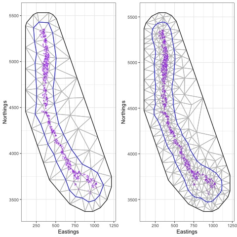
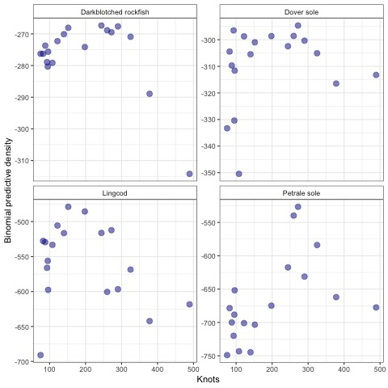
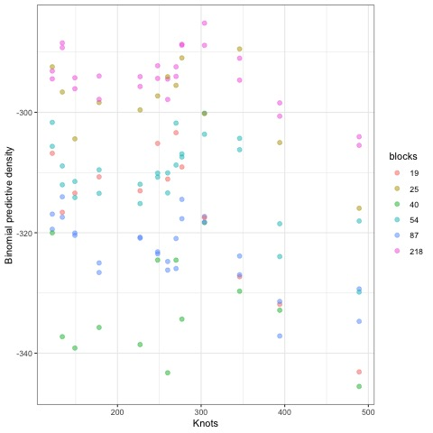
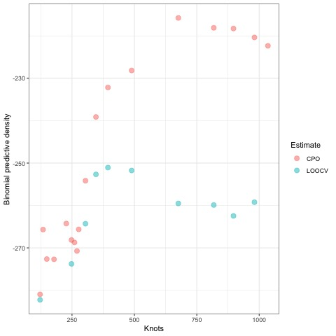
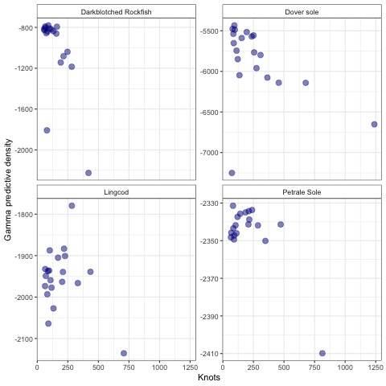
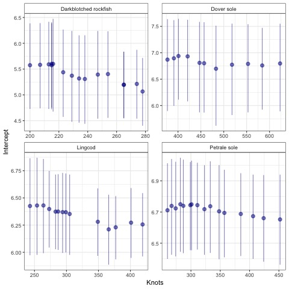

```{r setup, include=FALSE, echo=FALSE}
knitr::opts_chunk$set(echo = TRUE, tidy=FALSE, tidy.opts=list(width.cutoff=60), warning = FALSE, message = FALSE)
library(knitr)
library(ggrepel)
library(viridis)
library(gridExtra)
library(cowplot)
```

## Abstract

## Introduction

Recent computational advances have allowed for the rapid estimation of large spatial and spatiotemporal models in ecology and related fields [@banerjee_bayesian_2012]. Motivating questions for these applications to large georeferenced datasets including tracking abundance in time and space, identifying environmental predictors of occurrence, or quantifying range shifts in distribution [@ross_accessible_2012; @miller_spatial_2013; @thorson_comparing_2017].

There are a number of statistical approaches for developing models with spatial components; examples include generalized additive models (GAMs) [@forney_habitat-based_2012; @murase_application_2009], non-parametric approaches [@mutanga_high_2012], and applications of Gaussian random fields [@datta_hierarchical_2016; @latimer_hierarchical_2009]. Advances by @rue_approximate_2009 have enabled the development of the Integrated Nested Laplace Approximation (INLA) as a fast and efficient approximation to estimating high-dimensional Gaussian random fields. These models have been extended to include the ability to fit geographic barriers, such as islands or lakes, anisotropic covariance functions, and non-Gaussian data [@bakka_spatial_2018]. In addition to estimating Bayesian posterior distributions [@lindgren_bayesian_2015], INLA has been integrated with Template Model Builder (TMB; [@kristensen_tmb_2016; @osgood-zimmerman_statistical_2021]) to enable auto-differentiation and has been adopted in many spatial fisheries applications around the world [e.g., @johnson_investigating_2019; @thorson_measuring_2019].

Constructing spatiotemporal models with INLA or related software involves many of the same considerations as with simpler non-spatial models.
For example, modelers frequently ask: "Which covariates are most important?" and "Does my model do a satisfactory job of making predictions?" Spatial or spatiotemporal models may include additional considerations, such as specifying the form of spatiotemporal variation [@anderson_black_2019]. One of the more complicated and important decisions---particularly for INLA based models---lies in specifying the dimensionality of the latent spatial fields [@lindgren_bayesian_2015]. Unlike Generalized Additive Models (GAMs), which often penalize smooth terms [@wood2003], penalties in overfitting INLA models are not as apparent.

One of the first steps in fitting a model with INLA involves choosing the appropriate resolution of the spatial field using a "mesh" (a map consisting of small triangles, e.g., Figure 1).
By estimating values of the spatial field at the triangle vertices (or "knots"), the spatial field may be triangulated to coordinates where data are observed or predictions are made [@lindgren_explicit_2011]. There are a number of decision points to be made in constructing the mesh, including whether to include a boundary, whether the boundary is regular, the maximum edge of any triangle (in the core or boundary area), and the minimum angles allowed by the triangles [@gomez-rubio_bayesian_nodate]. Each of these decisions can impact the density and number of small triangles that make up the mesh---and in turn, the accuracy of predictions. Though the mesh construction is important, this step has been omitted from best practices guides using an INLA-based approach [@thorson_guidance_2019], and we are only aware of one sensitivity analysis examining the importance of mesh construction [@righetto_choice_2020]. While increasing the resolution of the mesh has been suggested to improve accuracy [@godana_dynamic_2019], other authors have also noted that finer meshes don't always translate into better predictions [@huang_evaluating_2017].

The objective of this paper is to demonstrate that higher resolution spatial approximations in INLA may not translate to better predictions.
Using a series of sensitivity analyses on a real world case study of groundfish data in the Northeast Pacific Ocean, we evaluate the out of sample predictive performance as a function of mesh resolution (number of vertices).
We further evaluate these results across a range of cross validation sampling schemes, including an extreme case of leave one out cross validation (LOOCV).
All data for our analysis are publicly available, and code and data to reproduce our analysis is on Github (XXXX).

## Methods

### Data

As an case study to evaluate the effect of mesh resolution on predictive ability of INLA based models, we use a publicly available dataset of catch rates from scientific surveys in the Northeast Pacific Ocean (<https://www.nwfsc.noaa.gov/data>)).
The West Coast Bottom Trawl Survey (WCBTS) dataset represents a fishery-independent survey collected annually over a 16-year period, 2003-2018, covering the California Current ecosystem on the west coast of the USA [@keller_northwest_2017].
The survey is designed to estimate the abundance, sizes, and age composition of commercially and recreationally targeted groundfish species found in near-bottom habitats.
The fundamental methods of the survey, sampling intensity, gear, seasonal and spatial coverage, and random stratified design have remained relatively constant.
Because of the large number of model runs needed, we restricted our analysis to only use data from 2018 (n = 702 observations).
Though hundreds of species our encountered in the survey, we also restrict our analysis to only include data from four species that are of interest to fisheries, but also represent a range of occurrences: dover sole (*Microstomus pacificus*, encountered in 593 tows), petrale sole (*Eopsetta jordani*, 291 tows), lingcod (*Ophiodon elongatus*, 225 tows), and darkblotched rockfish (*Sebastes crameri*, 105 tows).

### Modeling

Because of zero-inflation in the fish survey datasets like the WCBTS data, conventional approaches to analyzing this data have used a delta or hurdle model to separately model occurrence and positive catches [@johnson_investigating_2019; @thorson_guidance_2019].
We adopt a similar approach here, using a Binomial distribution (logit link) to model species occurrences, and a Gamma distribution (log link) to model positive catch rates.
For simplicity and consistency with fisheries assessments using these data, we fit models estimating an intercept and spatial field throughout, e.g.

$$g(u_{s}) = B_{0}+\omega_{s}$$\
where $\omega_{s}$ is the estimated spatial field.

All of the meshes in our analysis used a non-convex boundary and offset based on 5% of the data (Figure 1).
We fixed the maximum edge of triangles in the mesh at 100km in the core area and 500km closer to the boundary (Figure 1).
Throughout our analyses, we adjust the mesh resolution by varying the cutoff distance (representing the distance where 2 points are treated as a single vertex) because that has been shown to have the greatest impact on mesh construction [@righetto_choice_2020]. All models were fit using R-INLA [@r_core_team_r_2021; @lindgren_bayesian_2015] and specifically the 'inlabru' package, which is a convenient wrapper for the INLA software [@bachl_inlabru_2019]. Penalized complexity priors were used on the Matérn covariance parameters [@simpson_penalising_2015; @osgood-zimmerman_statistical_2021]. Code to replicate our analysis is provided on Github [link XXXX].

### Sensitivities

As a preliminary evaluation of whether the spatial resolution of INLA based models can result in overfitting, we evaluated 40 cutoff values for each species and hurdle sub-model included in our analysis (cutoff values ranging from 3-120km).
There is an inverse relationship between cutoff values and mesh resolution or vertices; while the results varied slightly by species, our meshes ranged in size from 75 - 1348 vertices.
The high resolution meshes with more vertices than observations were included as an upper extreme, though many applications of INLA to similar survey data have used 500-600 vertices [@thorson_guidance_2019; @tolimieri_spatio-temporal_2020].

To evaluate model performance, we conducted 10-fold cross-validation.
Though not a 1-dimensional dataset, the strong latitude gradient has driven spatial stratification in previous analyes [@keller_northwest_2017] (Figure 1). We a priori divided the survey domain into 10 spatial blocks by latitude quantiles (with approximately the same number of points in each box). Each model was run using inlabru [\@ @bachl_inlabru_2019], and used to predict the data for the held out test data.
The predictive density was calculated using the binomial or Gamma densities, and total predictive densities were calculated by summing across folds.

As a second sensitivity, we evaluated whether the particular cross-validation method used may be influencing the results.
Recent work has demonstrated that for spatially structured data, creating random folds that ignore spatial autocorrelation may bias results [@valavi_blockcv_2019]. Using the presence-absence data from Dover sole, we examined the cross validation performance across a range of mesh resolutions (cutoff values ranging from 15-75, or 122 - 594 vertices), number of spatial blocks (19 to 218) and number of folds used for cross validation (10, 40). Selection of spatial blocks was done using the 'blockCV' package in R [@valavi_blockcv_2019] with varying distance bands between test and training sets (25 - 150km).

To further validate the inference from the spatial cross-validation, we examined the performance of out of sample approximations in INLA.
We focused on the conditional predictive ordinate (CPO), which is an approximation to the leave-one-out cross-validation score (LOOCV).
In an ideal world, we would use cross validation to evaluate the out of sample predictive accuracy of a model.
The total predictive log density can be represented as the sum of individual log posterior probabilities, $\sum_{i=1}^{n} log[P(Y_{i}|Y_{\neq i})]$, where $P(Y_{i}|Y_{\neq i})$ is the probability of test data $i$.
Because conducting true leave one out cross-validation may be prohibitive for large datasets, INLA approximates the out of sample posterior probability for each observation.
Previous research has shown that the CPO approximation performs similarly to MCMC cross-validation [@held_posterior_2010], yet it is less clear whether CPO is similar to true cross validation in comparing mesh resolution.
Focusing on the presence-absence model of Dover sole (Figure 2), we first calculated the total CPO score across a range of cutoff values.
For comparison, we then calculated the true predictive density using LOOCV across a similar range of cutoffs (fitting the INLA model 702 times for each value).

## Results

Fig.
1 just demonstrates the data used in the study, and a couple mesh configurations (coarse and fine, cutoff of 20 and 80, translating to 394 and 110 vertices)

Fig.
2 shows the decline in performance as a function of large knots, across the 4 species.
Similarly, Fig S1 shows this for the gamma distribution.

Fig.
3 shows the decline in performance as a function of large knots happens regardless of the type of sampling used (sensitivity to \# blocks and \# folds).

Fig.
4.
shows the comparing between CPO (via INLA) and real LOOCV.
LOOCV shows that performance declines as knots become too large, but CPO keeps increasing

Fig.
5 Illustrates downstream effects of knots on estimates of downstream parameters ()

## Discussion

Larger meshes aren't necessarily better.
Others have pointed this out, <https://punama.github.io/BDI_INLA/>, but it gets overlooked

Sub-optimal meshes are likely to have an impact on derived things we care about, like indices of abundance -- both bias and precsion, fig s2

Datasets like the WCTBS support an optimal mesh of \~ 300 or fewer knots

We recommend analysts evaluate models across a range of resolutions and carefully consider what cross-validation scheme may be most appropriate for the question at hand

\break

## Figures

 \break

 \break

 \break



\break



\break



\break

# References
