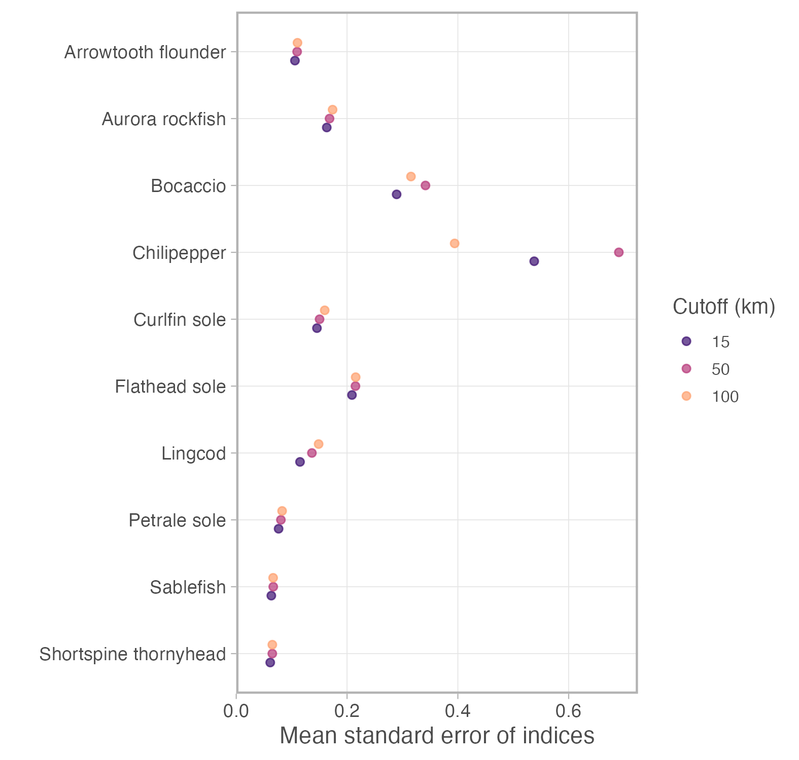
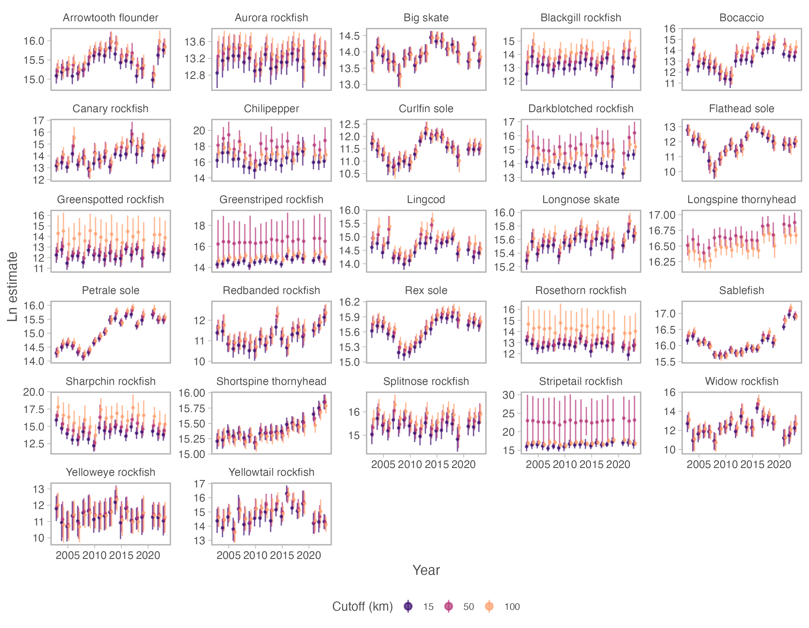

$^1$Conservation Biology Division, Northwest Fisheries Science Center, National Marine Fisheries Service, National Oceanic and Atmospheric Administration, 2725 Montlake Blvd E, Seattle WA, 98112, USA\
email: [eric.ward\@noaa.gov](mailto:eric.ward@noaa.gov){.email}\
$^2$Pacific Biological Station, Fisheries and Oceans Canada, Nanaimo, BC, V6T 6N7, Canada\
$^\dagger$ Authors contributed equally to this work

```{r setup, include=FALSE, echo=FALSE}
knitr::opts_chunk$set(echo = TRUE, tidy=FALSE, tidy.opts=list(width.cutoff=60), warning = FALSE, message = FALSE)
library(knitr)
library(ggrepel)
library(viridis)
library(gridExtra)
library(cowplot)
library(jpeg)
```

## Abstract

\setlength\parindent{24pt}

1.  Spatial and spatiotemporal models are seeing increasingly used in ecology and related fields to model latent distributions.
    Applications relying on these methods have used them to track population change over time, assess changing species distributions, and model spatial population processes (predation, habitat use, fishing impacts, etc).

2.  Computational advances over the last decade have allowed for the rapid estimation of spatial approximations to high dimensional spatial surfaces (100s or more georeferenced points), and these methods have been accessible in software implementing the Stochastic Partial Differential Equation (SPDE) appraoch.
    One of the most critical decisions for building SPDE--based models is how to construct the spatial approximation ("mesh").
    Little guidance has been established in constructing these approximations, with many previous applications suggesting that higher resolution meshes result in better performance.
    Using a publicly available dataset of commercially fished species on the west coast of the USA, we develop two cases studies; first we construct a spatial model of ocean temperature, and second we build spatial models of occurrence and catch rates for 6 groundfish species.
    We apply a series of sensitivity analyses to each example to understand how mesh resolution affects the predictive accuracy of models predicting species occurrences and catch rates.

3.  Our results highlight that for spatial models of temperature and catch rates, the finest scale spatial approximations generally overfit the data and resulted in decreased out of sample predictive performance.
    For each of the species and models considered, there appeared to be an optimal range of vertices (knots) used in constructing the spatial approximation.
    These results held across a range of spatial cross-validation sampling schemes.
    We found less clear results when working with binomial presence absence data -- while finer mesh resolutions resulted in better fits to training data,

4.  Results from our work highlight that practicioners should not assume that the performance of SPDE--based models improves with higher resolution.
    Instead, each dataset likely has a range of resolutions that results in optimal out of sample predictive performance; the resolution of these meshes may be identified using spatial cross-validation approaches, such as the sampling procedures used in our analysis.
    Selecting models with the appropriate spatial complexity is expected to improve parameter estimates and derived quantities (estimates of population abundance, distribution, etc.) when out of sample prediction is a focus of inference.

## Key words

Spatial, spatiotemporal, Stochastic Partial Differential Equation (SPDE), Integrated Nested Laplace Approximation (INLA), Gaussian random field, mesh, predictive accuracy

## Introduction

Recent advances in computational methods have revolutionized the estimation of spatial and spatiotemporal models in ecology and related fields [@banerjee_bayesian_2012].
These models address key questions, such as tracking species abundance over time and space, identifying environmental predictors of occurrence, modeling disease spread, and quantifying range shifts in distributions [@ross_accessible_2012; @miller_spatial_2013; @thorson_comparing_2017].
Application of these methods to large georeferenced datasets has become increasingly important as ecological and environmental challenges demand precise and scalable statistical tools.

A range of statistical approaches are available for modeling spatial processes; examples include generalized additive models (GAMs) [@forney_habitat-based_2012; @murase_application_2009], non-parametric approaches [@mutanga_high_2012], and applications of Gaussian random fields [@datta_hierarchical_2016; @latimer_hierarchical_2009].
Estimating these models can be computationally challenging for large georeferenced datasets [@banerjee_hierarchical_2004], necessitating the use of approximations or smoothing.
One solution to approximation is the Stochastic Partial Differentiation Equation (SPDE) approach [@lindgren_explicit_2011].
The SPDE method uses Gaussian Markov Random Fields (GMRF) to model the conditional distributions of values as only dependent on neighboring points; thus, rather than estimating a full rank covariance method to describe the spatial field, a sparse precision matrix can be estimated [@lindgren_explicit_2011].
Like other approximations, the SPDE approach can be seen as a form of smoothing [@yue2014].
[@miller2020] provide an excellent summary of the recent SPDE literature, and also show the link between these approaches and smoothing splines.

Advances by [@rue_approximate_2009] have enabled the SPDE approach to be implemented with the Integrated Nested Laplace Approximation (INLA) as a fast and efficient approximation to estimating high-dimensional Gaussian random fields with the Laplace approximation to the posterior distribution [@lindgren_bayesian_2015].
These models have been extended to include the ability to fit geographic barriers (such as islands or lakes), include anisotropic covariance functions, and non-Gaussian data [@bakka_spatial_2018].
Related software packages to increase the accessibility of these models includes inlabru [@bachl2019] and PointedSDMs [@mostert2023].
As an alternative to INLA, the SPDE approach has also been integrated with Template Model Builder (TMB; [@kristensen_tmb_2016]) to enable fast marginal maximum likelihood estimation, also via the Laplace approximation.
Software to implement the TMB--SPDE approach includes VAST [@thorson2019] and sdmTMB [@anderson2022], and comparisons between the INLA and TMB based approaches can be found in [@osgood-zimmerman2022].

Constructing spatiotemporal models with INLA or related software involves many of the same considerations as with simpler non-spatial models.
For example, analysts frequently ask: "Which covariates are most important?" and "Does my model do a satisfactory job of making predictions?" Spatial or spatiotemporal models may include additional considerations, such as specifying the type and complexity of spatiotemporal variation [@anderson_black_2019].
Because of the flexibility in these approaches, choices about how spatial processes are modeled can also affect inference about covariates; fitting an overly complex spatial process may mask effects of important covariates for example [@dambly2023].
One of the more complicated and important decisions---particularly for models implementing the SPDE approach---lies in specifying the dimensionality of the latent spatial fields [@lindgren_bayesian_2015].
Unlike Generalized Additive Models (GAMs), which often penalize smooth terms [@wood2003], there are not explicit penalties in overfitting with the SPDE approach in INLA.

A critical yet often overlooked step in SPDE--based modeling is constructing the spatial mesh--a triangular discretization that approximates the spatial field (Figure 1).
By estimating values of the spatial field at the vertices (also "nodes" or "knots"), the spatial field may be projected to coordinates where data are observed or predictions are made [@lindgren_explicit_2011].
Decisions regarding the mesh, such as its boundary shape, maximum triangle edge length, and minimum triangle angles, significantly impact model accuracy and computational efficiency [@gomez-rubio_bayesian].
While increasing mesh resolution generally improves the approximation of spatial processes, it may also introduce overfitting, computational challenges, and inflated standard errors for predictions.
While many previous applications and guidance around INLA have suggested that increasing the resolution of the mesh improves predictive accuracy [@godana_dynamic_2019; @wilson_evaluating_2021; @williamson_spatiotemporal; @thorson_guidance_2019], a much smaller number of studies have noted that finer meshes don't always translate into better performance [@huang_evaluating_2017] and we are only aware of several sensitivity analyses examining the importance of mesh construction [@righetto_choice_2020; @roste_2020; @dambly2023].

The objective of this paper is to examine whether higher resolution spatial approximations using the SPDE approach translate to better predictive accuracy, and provide general recommendations for identifying models with good out of sample predictive performance.
We develop three case studies based on a publicly available dataset of marine fishes in the Northeast Pacific Ocean.
First we develop a spatial model of ocean temperature from a single year, investigating the effect of mesh resolution on predictive performance and parameter estimation.
Second, we develop a spatiotemporal model of groundfish occurrence for 28 species, examining the effect of mesh resolution and spatial blocking on predictive performance.
Finally, we extend the groundfish occurrence models to trend estimates, and examine potential effects of mesh resolution on standard errors of biomass estimates.
All data for our analysis are publicly available, and code and data to reproduce our analysis is available on Github (<https://github.com/ericward-noaa/how-many-knots>) and Zenodo (on publication).

## Methods

### Data

To evaluate the effect of mesh resolution on the predictive ability of models using the SPDE approach, we used a publicly available scientific survey of marine fishes in the Northeast Pacific Ocean (<https://www.nwfsc.noaa.gov/data>).
The West Coast Groundfish Bottom Trawl Survey (WCGBTS) data represents a fishery-independent survey collected annually over a 21-year period, 2003-2023 (no survey in 2020), covering the California Current ecosystem on the west coast of the USA [@keller_northwest_2017].
The survey is designed to estimate the abundance, sizes, and age composition of commercially and recreationally targeted groundfish species found in near-bottom habitats.
The fundamental methods of the survey, sampling intensity, gear, seasonal and spatial coverage, and random stratified design have remained relatively constant.
In addition to collecting biological samples, the survey also measures environmental variables, such as water temperature at the depth of the net.
Importantly, this survey shares similar characteristics to many other bottom trawl survey datasets used to monitor marine fishes around the world.

### Modeling ocean bottom temperature

As a first case study examining the impacts of mesh resolution on predictive ability and parameter inference, we constructed a spatial model of bottom temperature from the WCGBTS survey.
To keep the initial application simple and avoid complications introduced by spatiotemporal variation, we used a single year of data (2018, n = 701 observations).
Because the survey spans nearly five months (19 May – 15 October), we included day of year as a quadratic predictor, to allow for seasonal changes in mean temperature.
Extending notation used in linear mixed effect models, our model can be expressed as

$$u_{i} = b_{0}+b_{1}x_{i}+ b_{2}x_{i}^{2}+\omega_{i}$$\

where $\omega_{i}$ is the estimated spatial field at the location of the ith observation and modeled as $\omega \sim MVN(0,\Sigma_\omega)$, $b_0$ is the intercept, $x_{i}$ is the day of year, $b_1$ and $b_2$ are estimated coefficients, and $u_{i}$ is the expected value incorporating fixed and random effects.
Although temperature is expected to exhibit a strong correlation with depth, we excluded depth from the model due to the presence of a pronounced spatial gradient along the continental shelf in the California Current system [@keller_northwest_2017].
Finally, we assumed the observed temperature values followed a Gaussian distribution.

Mesh resolution was varied by modifying the cutoff distance (representing the distance where two points are treated as a single vertex) because previous research has shown that cutoff distance is one of the more meaningful parameters in determining mesh resolution [@righetto_choice_2020].
There is an inverse relationship between cutoff distance and mesh resolution that varies slightly dataset to dataset; we varied cutoff distances between 8--500km (corresponding to 24--727 vertices for this example).
For each mesh resolution, we performed k-fold cross validation, using 10 folds with points assigned randomly to each.

### Modeling species occurrence

As a second example, we constructed a case study focused on modeling groundfish occurrence from samples taken from the WCGBTS survey, 2003 -- 2023.
The primary objectives of this example are to examine the impacts of mesh resolution on predictive performance in the presence of spatial and spatiotemporal variation, and to explore cross validation designs that involve spatial blocking.
We developed an initial list of 28 species, representing many that are of commercial or conservation interest (Table 1).
These species represent a range of average occurrence values (from 2% to more than 60% of hauls), and differ with respect to spatial variability and spatial ranges, because of differences in life history, ontogeny, and movement.

We applied the same form of the spatiotemporal model to all species so that for observation $i$,

$$g(u_{i}) = \mathbf{X_{i}}\mathbf{b}+ \omega_{i} + \epsilon_{i,t}$$\

where for convenience the fixed effect design matrix and coefficients are collapsed into $\mathbf{X}$ and $\mathbf{b}$ respectively, $\omega_{i}$ represents spatial variation $\omega \sim MVN(0,\Sigma_\omega)$ and $\epsilon_{i,t}$ represents spatiotemporal variation that is assumed independent by year, $\epsilon_{t} \sim MVN(0,\Sigma_\epsilon)$.
We modeled presence--absence with a binomial distribution, $g()$ represents a logit link function.
We included year (as a factor) as the only covariate in this model, allowing the average probability of occurrence to vary by year.

We expanded on our initial case study and developed custom meshes.
First, we used a non-convex hull to define a boundary, and incorporated the boundary into each mesh, along with a specified cutoff distance (12--175km).
We used 5% offsets for the mesh and boundary (shrinking these toward the data) and set the maximum inner and outer triangle edges at 100 and 500km, respectively.
Meshes varied slightly by species, but the range of cutoff values resulted in meshes ranging in size from 51--893 vertices.
High-resolution meshes were included as an upper extreme, though many applications of the SPDE approach to datasets with similar dimensions have used 500--600 knots [e.g., @thorson_guidance_2019; @tolimieri_spatio-temporal_2020].

For each combination of species and mesh, we performed k-fold cross validation, using 10 folds and random fold assignments, as in our temperature case study.
To better understand the impact of spatial blocking in assigning folds, we also performed cross-validation using spatial blocks.
Given the rectangular domain of the survey area (Figure 1), we divided the domain into latitudinal strips with a fixed strip width, and assigned each resulting strip to a fold in ascending order (1, 2, 3, ..., 8, 9, 10, 1, 2, ...).
We explored a range of strip heights for each species (from 10 to 150km, in steps of 20km) and repeated the model fitting for each.

### Modeling biomass indices

As a third example, we examined the effect of mesh resolution on biomass indices generated from the WCGBTS survey data.
A common use of bottom trawl survey data is to estimate annual indices of biomass, to be used in downstream integrated population models (stock assessments in fisheries).
We used data from the same 28 species from our occurrence modeling example (Table 1) to generate standardized indices of biomass [@thorson2015; @thorson2013].
For each species, we constructed three meshes with cutoff distances of 15, 50, and 100km.
Unlike our previous examples, we did not apply cross validation, but fit a single model to the entire dataset.
For simplicity, we assumed the mesh for each species covered the entire spatial domain of the survey, and we did not filter data a priori (some previous population models have applied depth filters for instance).
Catch per unit effort (CPUE, kg per km2) was used as a response variable, and because observations are both zero-inflated and skewed, we modeled CPUE as a two-part hurdle- or delta-model, with a Gamma distribution used for positive catches [@pennington1983].
Like our occurrence models, we only included year effects (as a factor variable) – though in this application, two sets of fixed effects coefficients are estimated, one for each sub-model.
We also included spatial fields and spatiotemporal fields (assumed independent by year), with a shared range assumed between the spatial and spatiotemporal fields [@anderson2022].
Standardized indices of biomass were generated by making model predictions on the survey design grid for each year (12000 2nm by 1.5nm cells of equal area; [@keller_northwest_2017]) and then summing across grid cells within a year to get annaul indices of total biomass.

### Estimation

We fit all models in R [@r2023] using the package sdmTMB [@anderson2022], which combines the SPDE approach for spatial models with the speed of maximum marginal log likelihood estimation using Template Model Builder (TMB, [@kristensen_tmb_2016]).
TMB leverages automatic differentiation to quickly converge on parameter estimates, and it applies the Laplace approximation to integrate out random effects, including spatial or spatiotemporal components.
We used the `sdmTMB_cv()` function to implement k-fold cross validation for all examples.
Model convergence was assessed using the `sanity()` function in sdmTMB; we only retained models that successfully converged (positive-definite Hessian matrix, maximum absolute log likelihood gradient \< 0.001).
Data and code to replicate our analysis are publicly available on Github, <https://github.com/ericward-noaa/how-many-knots>

### Quantifying performance

To quantify the predictive performance of models with different mesh configurations, we calculated two measures of performance for each of our first two examples and applied them separately to training and test data in each fold.
For a first metric, we calculated Root Mean Squared Error (RMSE) as a measure of accuracy for the temperature modeling example, and the Area Under the Curve (AUC) statistic from the Receiver Operating Characteristic (ROC) occurrence for our presence absence models of groundfish.
Second, we calculated the total log-predictive density (log-score), which evaluates both accuracy and precision.

## Results

### Temperature case study

Our spatial models of ocean temperature demonstrated that the relationship between cutoff distance (or vertices in the mesh) and predictive density was generally in opposite directions for training data used to fit the model versus out of sample testing data used to evaluate predictions (Figure 2).
Predictive density increased for the training data (indicating an improvement in fit) as the mesh resolution increased (Figure 2), and increased for the test data up to 400 vertices.
For higher resolution meshes, our results demonstrate a decline in predictive performance for out of sample data.

Examining the relationship between estimated model parameters and cutoff distance (or vertices in the mesh), we found that fixed effect parameters associated with the day of year were largest in magnitude for coarse meshes, and became closer to 0 as the number of vertices increased (Figure 3).
Our results also highlight that the highest resolution meshes are associated with the smallest values of spatial range, spatial variability, and observation error variance (Figure 3).
As meshes become more coarse, observation error variance increases, and the spatial parameters appear to increase initially before stabilizing (Figure 3).

### Groundfish occurrence

Results from our groundfish occurrence models are largely consistent with our temperature models, in that estimated spatial ranges generally become smaller with finer meshes, and there is consistency across bin widths used for spatial blocking.

spatial range versus vertices is fairly consistent across bin widths, and declines for most species as a function of n (as we expect, from first case study)

-   the out of sample log-likelihood is highest when using random fold assigngments and decreases as a function of strip heights.
    Why?
    As the strip height increases, the spatial models are trying to predict further and further beyond the range of their data (in some cases, more than the spatial range) and predicitve ability becomes greatly diminished

Our models of groundfish presence--absence demonstrated that the effect of mesh resolution on the fit to training data with the binomial sub-model was weakest for species with lowest occurrence rates (Pacific Ocean perch, Darkblotched rockfish, Figure 3).
The relationship between mesh resolution and out of sample predictive performance appeared more variable.
When spatial structure is ignored in designating folds, finer meshes appear to have the best out of sample performance across species (Figure 3).
However when spatial blocks are used for cross validation the finest meshes don't consistently outperform coarser ones (finer meshes result in worse predictive performance for lingcod, Petrale sole, and sablefish, and Dover sole).
Increasing the spatial buffer (range) between test and training data in the `blockCV` package translates to smaller blocks ()

### Groundfish biomass indices

Our spatiotemporal models of groundfish biomass included year effects, but no other covariates.
For many species in our dataset, we found similar trends and biomass indices across the three cutoff distances examined (15, 50, 100km; Figure S1).
In some cases, the scale of trend estimates was shifted slightly higher or lower (aurora rockfish, longspine thornyhead), but the average standard errors of biomass estimates are qualitatively similar and do not depend on cutoff distances.
The exception to this general pattern was that for several rockfish species, both the biomass scale and standard errors did appear to be impacted by the choice of cutoff distance (greenspotted, greenstriped, rosethorn, sharpchin, stripetail; Figure 5).

## Discussion

Spatial and spatiotemporal models are becoming increasingly used in ecology, fisheries, and related sub-fields, in particular to address questions related to changing species distributions in time and space.
High dimensional datasets with hundreds of observations introduce computational challenges, but complicated spatial structure can be efficiently approximated using the SPDE approach [@miller2020].
Combined with the INLA software for estimation [@rue_approximate_2009], these tools have become widely accessible.
Though a number of examples and best practices papers have been written to demonstrate how to construct models or specify hyperparameters [@lindgren_bayesian_2015; @gomez-rubio_bayesian], advice on specifying the SPDE mesh to approximate spatial processes can be confusing.

There are certainly situations where it is advantageous to fit SPDE models with the highest resolution mesh possible.
Increasing the mesh resolution yields a better approximation of the latent spatial process; our results are consistent with previous research showing that this generally yields a better fit to the data (Figs. 2-4).
Previous work has shown increasing the SPDE mesh resolution up to a point will make estimates of parameters of interest stabilize [@roste_2020].
Thus, if a goal of inference is identifying precise relationships between environmental or habitat covariates and species' occupancy or density, then meshes lots of vertices would be preferred to coarser ones.

Disadvantages of fine SPDE meshes become more apparent in scenarios where spatial interpolation from a SPDE mesh is a focus of inference; example applications include when predictions are used to derive indices of population abundance, area occupied by a species, or centre of gravity.
Using a publicly available dataset of groundfishes in the NE Pacific Ocean, we demonstrate that models of occurrence and catch rates with the finest spatial approximations have deteriorating predictive performance for out of sample data.
Declines in out of sample predictive performance with too many knots appears robust to (1) how data are spatially sampled for cross-validation, (2) the specific penalized complexity priors used for the Matern function, and (3) whether estimation is done using INLA or maximum likelihood with TMB.
Datasets like the groundfish case study used here (n = 702) support meshes with \~ 300 or fewer knots, though some of the models supported even fewer (in particular, species with low occurrence rates, such as Darkblotched rockfish or Pacific Ocean perch).

While there are a number of alternative ways to measure model performance, we recommend using k-fold cross-validation to explore predictive accuracy across a range of meshes.
Tools like AIC have also been used to discriminate among these types of models, however AIC is known to be problematic when used as a metric to compare mixed effects models [@harrison_brief_2018] or as a tool to estimate spatial complexity [@velasco_2019].
Similarly, while WAIC is available in INLA, higher resolution meshes generally correspond to better WAIC values [@roste_2020].
Results from our comparison of presence absence models of Dover sole suggested some similarity between using the conditional predictive ordinate (CPO) [@pettit1990] and true LOOCV, which the CPO aims to approximate.
Thus, for large datasets where cross validation may be challenging, CPO may also be useful in identifying meshes with good out of sample predictive ability.

Comparing the performance of models with alternative spatial complexity obviously introduces additional computational burdens, both in performing cross-validation, and comparing models with different numbers of knots.
This challenge is not unique to models using the INLA--SPDE approach; selecting both the location and number of knots is a general problem for knot--based spatial models.
Other examples of spatial statistics models that have encountered this issue include machine learning methods (reviewed in [@banerjee2013]), Gaussian Process models [@garton2020] and P-splines [@ruppert2002].
Identifying a range of knot values that yield good predictive performance will be specific to individual datasets (e.g. magnitude of observation error, spatial autocorrelation, number of observations, type of response).
The optimal mesh resolution for one species may be informative for other species from the same dataset, potentially reducing the computational overhead.
Though some work has suggested vertices be chosen relative to the spatial range of a dataset [@roste_2020], this advice creates a somewhat circular framework in that the range is usually known after a reasonable spatial model is constructed.

TODO -- CONCLUDING PARAGRAPH, FUTURE RESEARCH ETC 4.
Future research paragraph - larger comparison across species and datasets - is this a feature of triangulation with inla?
would we get better estimates from a higher dimensional GP model?
- don't use WAIC - identifying the appropriate spatial complexity is important for

Recommendations:

-   If using these tools for index standardization, and you're comparing model structures (but you don't care about comparing specific covariates, and are not drawing inference about fixed effects themselves), then fitting large meshes is fine and will generate indices that approximate the data well.
    It is important to note though that most parameters associated with random effects or variances will become smaller as the knots increase, so inference should not be drawn from these.
    Overly fine meshes may degrade out-of-sample performance due to overfitting

-   If these tools are being used to compare models with different covariates, or to compare spatial parameters (ranges, variance) across models, then we recommend fitting multiple models with a range of mesh resolutions, and focusing on those that fit the training data well and have good out of sample performance for the test data.
    In these cases, spatial blocking of cross validation will also impact parameters, and it's useful to make sure that the block (or strip) dimensions are smaller than the spatial range.

## Acknowledgements

We would like to express our gratitude to Dave Miller, Andy Seaton, and Ole Shelton for helpful comments that improved our analysis and presentation of results.

\break

## Figures

```{r fig1, echo=FALSE, fig.cap = "Example of two meshes constructed for the California Current Ecosystem, using the 2018 WCGBTS survey data. Cutoff values of 80 and 20km are used, translating into 110 and 394 knots (vertices) respectively.", out.width="90%", out.height="90%"}
knitr::include_graphics("figures/Figure_01.png")
```

\break

```{r fig2, echo=FALSE, fig.cap = "2018 sampled ocean temperature (Celsius) from the 2018 WCGBTS survey (sample locations further offshore are typically at greater depth, and colder). Also shown is the average point-wise log-likelihood as a function of mesh features (cutoff distance, number of vertices), where the log-likelihood is calculated for training and test datasets and normalized by the number of samples in each, using 10-fold cross validation with random fold assignments."}
knitr::include_graphics("figures/Figure_02.png")
```

\break

```{r fig3, echo=FALSE, fig.cap = "Estimated fixed effect parameters (top row) and spatial parameters (bottom row) as a function of mesh cutoff distance for the ocean temperature example. Solid lines represent average estimates, and points represent 95% confidence intervals"}
knitr::include_graphics("figures/Figure_02b.png")
```

\break

```{r fig6, echo=FALSE, fig.cap = "Mean standard errors of biomass estimates (log space)  estimated for each species across three mesh resolutions (larger cutoff distances result in coarser meshes)."}

```

\break

```{r fig_s1, echo=FALSE, fig.cap = "Time series of biomass estimates estimated for each species, across three mesh resolutions (larger cutoff distances result in coarser meshes)."}

```

\break

```{r table1, echo=FALSE, fig.cap = "Table of groundfish species included in our presence absence modeling"}
species <- read.csv("species_names.csv")
species <- dplyr::rename(species,
                         "Common name" = common_name,
                         "Scientific name" = sci_name)
knitr::kable(species)
```

\break

# References
